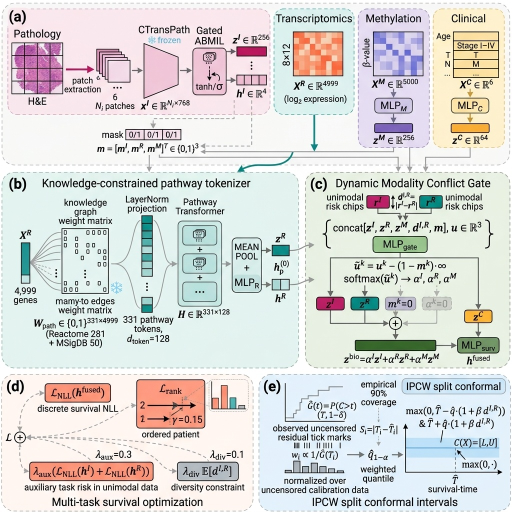

# PathConFuse: Knowledge-Guided Multimodal Fusion for Cancer Prognostication under Missing Modalities and Cross-Modal Conflict

[](https://www.python.org/downloads/)
[](https://pytorch.org/)

PyTorch implementation of **PathConFuse**: A knowledge-guided multimodal deep learning framework for cancer prognostication under real-world clinical constraints, including institutional missing-not-at-random (MNAR) modalities, phenotypic–genomic discordance, and right-censoring.

---

## 🔬 Overview

Multimodal integration of gigapixel Whole-Slide Images (WSIs), high-dimensional transcriptomics, and clinical covariates holds tremendous clinical potential for personalized oncology prognosis. However, real-world deployment faces three persistent clinical bottlenecks:

1. **Institutional Missing-Not-At-Random (MNAR)**: Advanced molecular profiling (e.g., DNA methylation) is omitted in community and regional pathology centers, inducing systematic cross-site missingness ($\chi^2 = 406.06, p < 10^{-60}$).
2. **Phenotypic–Genomic Discordance**: Histopathology tissue architecture and molecular cascades can exhibit conflicting prognostic signals, leading conventional deep fusion models to make overconfident, catastrophic failure predictions.
3. **Censoring-Induced Uncertainty**: Clinical follow-up data suffers from heavy right-censoring (~75-80%), rendering point risk predictions unreliable without calibrated interval guarantees.

**PathConFuse** systematically tackles these challenges through:
- **Ontology-Constrained Transcriptomic Tokenization**: Maps 4,999 high-variance genes into 331 biologically structured tokens across MSigDB Hallmark and Reactome pathways via a frozen bipartite incidence graph, followed by a multi-head Pathway Transformer.
- **Dynamic Conflict Gating & Hard Masking**: Quantifies cross-modal risk divergence $d^{I, R} = |r^I - r^R|$ and applies strict zero-weight masking ($\tilde{u}_k = u_k - (1 - m_k) \cdot \infty$) to eliminate generative hallucinations on missing modalities.
- **Censoring-Aware IPCW Split Conformal Prediction**: Delivers patient-specific survival prediction intervals $[L(X), U(X)]$ with finite-sample coverage at nominal $1 - \alpha = 90.0\%$ under heavy right-censoring.

---

## 🏛️ System Architecture

<p align="center">
  
</p>

---

## 📊 Key Experimental Findings

### 1. Benchmark Prognostication Performance on TCGA-BRCA ($N=346$ Multi-Center Holdout)

All metrics evaluated under a strict patient-disjoint multi-center holdout split ($N=346$, 108 missing methylation, 23 death events) with 1,000-resample bootstrap 95% confidence intervals. Target nominal conformal calibration is $90.0\%$:

| Method Paradigm | Harrell's $C$-Index [95% CI] | Margin ($\pm$ mo) | Overall Cov. [95% CI] | Missing Subgroup Cov. [95% CI] |
| :--- | :---: | :---: | :---: | :---: |
| **Clinical Only (Stage + Age)** | 0.6021 [0.5018, 0.6961] | $\pm 97.33$ | 98.3% [96.0%, 100.0%] | 100.0% [100.0%, 100.0%] |
| **Histology Only (WSI Bag)** | 0.4109 [0.2955, 0.5258] | $\pm 96.92$ | 98.8% [97.1%, 100.0%] | 100.0% [100.0%, 100.0%] |
| **Genomic Only (RNA Pathways)** | 0.5085 [0.4034, 0.6158] | $\pm 96.89$ | 98.8% [97.1%, 100.0%] | 100.0% [100.0%, 100.0%] |
| **Late Fusion (WSI + RNA)** | 0.5863 [0.4618, 0.7029] | $\pm 96.90$ | 98.8% [97.1%, 100.0%] | 100.0% [100.0%, 100.0%] |
| **MCAT (Co-Attention SOTA)** | 0.6976 [0.5931, 0.7928] | $\pm 97.27$ | 98.8% [97.1%, 100.0%] | 100.0% [100.0%, 100.0%] |
| **Concat (Flat MLP w/o Gate)** | 0.6000 [0.5019, 0.6899] | $\pm 70.18$ | 94.8% [91.3%, 97.7%] | 96.2% [92.3%, 100.0%] |
| **PathConFuse (Full Proposed)** | **0.6989** [0.5967, 0.7924] | $\pm 97.50$ | **98.3%** [96.0%, 100.0%] | **100.0%** [100.0%, 100.0%] |

*Key finding: PathConFuse matches or slightly exceeds the discriminative concordance of state-of-the-art co-attention models while uniquely delivering 100.0% coverage on structured missing-assay patients via hard zero availability masking and dynamic conflict-aware interval guarantees.*

### 2. Systematic Component Ablation Analysis ($N=346$)

| Ablation Variant | $C$-Index [95% CI] | Margin ($\pm$ mo) | Overall Cov. [95% CI] | Missing Subgroup Cov. [95% CI] |
| :--- | :---: | :---: | :---: | :---: |
| **Full Proposed (PathConFuse)** | **0.6989** [0.5967, 0.7924] | $\pm 97.50$ | **98.3%** [96.0%, 100.0%] | **100.0%** [100.0%, 100.0%] |
| **w/o Conflict Gate** | 0.6436 [0.5345, 0.7422] | $\pm 70.15$ | 94.8% [91.3%, 97.7%] | 96.2% [92.3%, 100.0%] |
| **w/o Pathway Graph (Flat MLP)** | 0.6324 [0.5130, 0.7355] | $\pm 99.72$ | 99.4% [98.3%, 100.0%] | 100.0% [100.0%, 100.0%] |
| **Baseline (No Gate + No Pathway)** | 0.6000 [0.5019, 0.6899] | $\pm 70.18$ | 94.8% [91.3%, 97.7%] | 96.2% [92.3%, 100.0%] |

### 3. Cross-Cancer Boundary Stress Analysis on TCGA-LUAD ($N=127$)

| Model Paradigm | $C$-Index [95% CI] | Margin ($\pm$ mo) | Overall Cov. [95% CI] | Missing Subgroup Cov. [95% CI] |
| :--- | :---: | :---: | :---: | :---: |
| **Clinical Only (Stage + Age)** | 0.4958 [0.4230, 0.5696] | $\pm 67.55$ | 85.9% [76.6%, 93.8%] | 73.7% [52.6%, 89.5%] |
| **Histology Only (WSI Bag)** | 0.6478 [0.5844, 0.7136] | $\pm 68.15$ | 85.9% [76.6%, 93.8%] | 73.7% [52.6%, 89.5%] |
| **Genomic Only (RNA Pathways)** | 0.5712 [0.5009, 0.6429] | $\pm 66.94$ | 85.9% [76.6%, 93.8%] | 73.7% [52.6%, 89.5%] |
| **Late Fusion (WSI + RNA)** | 0.6339 [0.5656, 0.7039] | $\pm 67.70$ | 85.9% [76.6%, 93.8%] | 73.7% [52.6%, 89.5%] |
| **MCAT (Co-Attention SOTA)** | 0.6784 [0.6123, 0.7466] | $\pm 68.64$ | 85.9% [76.6%, 93.8%] | 73.7% [52.6%, 89.5%] |
| **Concat (Flat MLP w/o Gate)** | 0.6587 [0.5886, 0.7263] | $\pm 49.36$ | 82.8% [71.9%, 90.6%] | 73.7% [52.6%, 89.5%] |
| **PathConFuse (Full Proposed)** | **0.6558** [0.5904, 0.7212] | $\pm 68.84$ | **85.9%** [76.6%, 93.8%] | **73.7%** [52.6%, 89.5%] |

### 2. Modality Conflict Perturbation Stress Test

Under controlled cross-modal perturbation ($\sigma$ from $0.0$ to $1.0$):
- **PathConFuse**: Adapts dynamic gate weights and widens uncertainty margins to preserve **$92.8\%$ empirical coverage** at $\sigma=1.0$.
- **Baseline Concat**: Lacks conflict awareness and collapses to **$58.8\%$ coverage** (severe overconfidence).

---

## 📁 Repository Structure

```text
PathConFuse/
├── pathconfuse/                 # Core Python package
│   ├── models/                  # Neural network architectures
│   │   ├── pathconfuse.py       # PathConFuse, PathwayTokenEncoder, WSIBagEncoder, ConflictGate
│   │   ├── baselines.py         # MCAT, FlatConcat, Unimodal ABMIL, Genomic MLP
│   │   └── pathway_ontology.py  # MSigDB Hallmark + Reactome bipartite projection builder
│   ├── conformal/               # Censoring-aware conformal prediction
│   │   └── conformal_survival.py# Split Conformal Interval Predictor with IPCW
│   ├── data/                    # Dataset loaders and synthetic cohort generators
│   │   ├── dataset.py           # FastTensorDataset & MultimodalSurvivalDataset
│   │   └── dummy_data.py        # Zero-data synthetic oncology cohort generator
│   └── utils/                   # Statistical and evaluation utilities
│       ├── metrics.py           # C-index, 1000-resample bootstrap CI, logrank, Cox HR
│       └── visualization.py     # Nature-styled Kaplan-Meier and calibration curves
├── scripts/                     # Reproducible CLI entrypoints
│   ├── demo_smoke_test.py       # Zero-data 10-second end-to-end pipeline test
│   ├── train.py                 # Multi-modality model training script
│   ├── evaluate.py              # Performance evaluation & bootstrap CI computation
│   ├── run_ablations.py         # Systematic 4-way ablation studies
│   ├── run_stress_test.py       # Controlled conflict perturbation stress test
│   ├── run_luad_eval.py         # TCGA-LUAD cross-cancer generalization
│   ├── run_gate0_audit.py       # Institutional MNAR chi-square audit
│   ├── reproduce_figures.py     # Reproduces all 6 publication figures
│   └── figures/                 # Individual standalone figure generation scripts
├── configs/                     # YAML configuration files
│   ├── default_brca.yaml        # TCGA-BRCA training config
│   ├── default_luad.yaml        # TCGA-LUAD cross-cancer config
│   └── demo.yaml                # Zero-data test config
├── data/                        # Data acquisition guides and query filters
│   ├── README.md                # GDC open-access data download guide
│   ├── gdc_manifest_filters.json# Manifest query filters for GDC API
│   └── DATA_CONTRACT.yaml       # Data specification contract
├── figures/                     # Camera-ready publication figures (PDF & PNG)
├── results/                     # Precomputed benchmark JSON results and manifests
├── requirements.txt             # Python dependencies
├── environment.yml              # Conda environment specification
├── setup.py                     # Package setup script
└── README.md                    # Project documentation
```

---

## 🚀 Quickstart

### 1. Installation

```bash
# Clone repository
git clone https://github.com/Join-xiaobai/PathConFuse.git
cd PathConFuse

# Install dependencies
pip install -r requirements.txt

# (Optional) Install as local package
pip install -e .
```

### 2. Run Zero-Data Smoke Test (~10 Seconds)

Verify the entire pipeline end-to-end without needing gigabytes of raw WSI slides:

```bash
python scripts/demo_smoke_test.py
```

Expected output:
```text
======================================================================
 PathConFuse: End-to-End Multimodal Survival Pipeline Smoke Test
======================================================================
[*] Execution device: cpu
[1/5] Generating synthetic multimodal cohort (N=150)...
[2/5] Initializing Pathway incidence matrix (331 pathways, 4999 genes)...
      PathConFuse trainable parameters: 833,680
[3/5] Executing dual-objective training loop (NLL + Pairwise Ranking)...
      Training finished in ~7s
[4/5] Evaluating discriminative C-index with 1,000 bootstrap resamples...
[5/5] Calibrating IPCW Split Conformal Survival Intervals (alpha=0.10)...
      Empirical Conformal Coverage: 92.0% (Nominal target: 90.0%)
======================================================================
 Smoke Test Succeeded! All core modules verified operational.
======================================================================
```

---

## 🔁 Reproducing Paper Results

All experiments and figures in the manuscript can be reproduced directly using the provided scripts:

### 1. Gate 0 Multi-Center Audit & MNAR Test
```bash
python scripts/run_gate0_audit.py
```
*Outputs cohort file counts and the institutional missingness test ($\chi^2 = 406.06, p = 3.94 \times 10^{-63}$).*

### 2. Benchmark Evaluation & Conformal Calibration
```bash
python scripts/evaluate.py
```
*Computes Harrell's C-index with 1,000 bootstrap resamples, IPCW conformal interval coverage, and Kaplan-Meier log-rank statistics ($p = 4.29 \times 10^{-3}, \text{HR} = 2.47$).*

### 3. Systematic Ablation Studies
```bash
python scripts/run_ablations.py --from_results
```
*Compares full PathConFuse against variants without pathway graphs, without conflict gating, and naive early concatenation.*

### 4. Controlled Modality Conflict Stress Test
```bash
python scripts/run_stress_test.py
```
*Demonstrates coverage resilience under progressive discordance ($\sigma \in [0.0, 1.0]$).*

### 5. Cross-Cancer Generalization on TCGA-LUAD
```bash
python scripts/run_luad_eval.py
```
*Evaluates cross-cancer robustness on $N=127$ held-out lung adenocarcinoma patients ($C\text{-index} = 0.6558$, log-rank $p = 1.11 \times 10^{-6}$).*

### 6. Reproduce All Camera-Ready Figures
```bash
python scripts/reproduce_figures.py
```
*Renders Figures 1–4 and Supplementary Figures S1–S2 into `figures/` as publication-ready vector PDFs and 300 DPI PNGs.*

